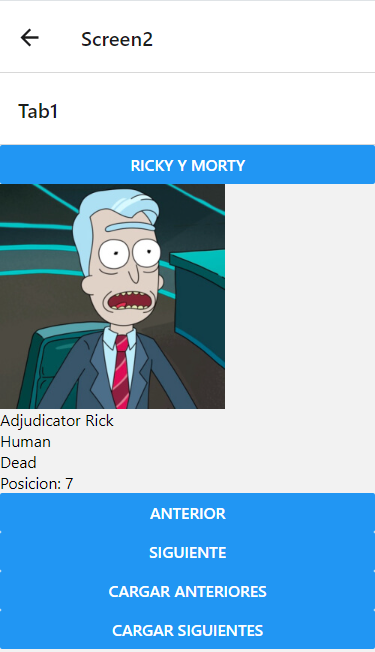
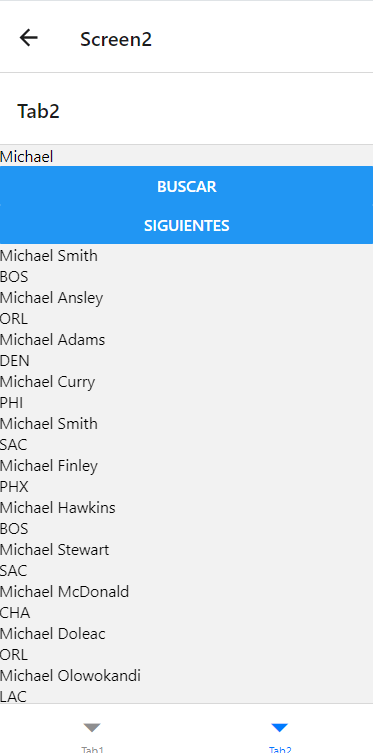

# Introduction

Welcome to my React-Native projects. To simplify the repository, I will only upload the necessary code for the application to work on [Snack](https://snack.expo.dev/), a page where you can see the applications in action by simply copying and pasting the code.

The code for each project is located in the branch indicated for each case.

## Calculator

This is a basic scientific calculator.

Branch: Calc

## Simple Game

These two games are a collaborative project using the SCRUM methodology, meaning it is a minimum viable product.

On the first screen, we have a crossword puzzle. By clicking the title, word definitions appear.

On the second screen, we have a title. By clicking, a word search puzzle appears.

Since it is a collaborative work, the code is in another repository.

[Link to the repository](https://github.com/hugoestelles/PMDM_AE2)

## API Handling

This is a project with various navigations where I use different APIs.

On the 'Home' screen, there are two buttons to navigate to different screens.

On 'Screen 1', we can enter text and the number of rows. The application will modify the text to appear vertically divided into the specified rows. For example, if we enter "four" and 2 rows, we get:

f u
o r

On 'Screen 2', there is a tab navigation with two more screens, each with its APIs and functionalities. In the first tab screen, I use a Rick and Morty API to load characters and navigate circularly. That is, if we are at position 1 and click back, it will take us to position 20. The next and previous buttons do the same but in increments of 20.

In the second tab screen, I use a basketball players API to search for players by name. It shows 20 players per page with the option to navigate through pages until reaching the end of the list. If we click next at the end, it will take us back to the beginning of the list.

Branch: APIS

## BMI Calculator

This is a BMI calculator based on weight and height.

Branch: IMC

## FakeStagram

Imitation of the Instagram design.

Branch: IG
