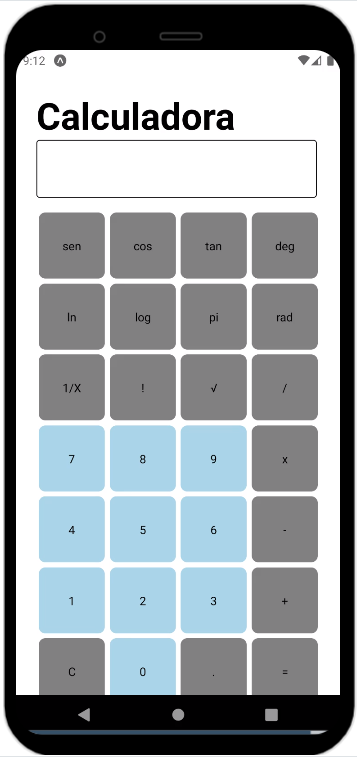
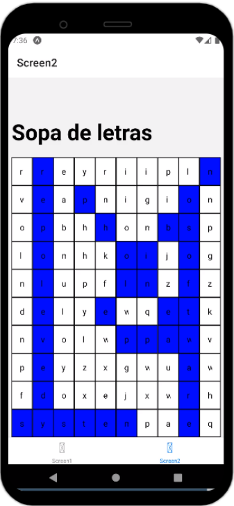

#Introducción

Bienvenido a mis proyectos en React-Native, para simplificar el repositorio solo subiré el codigo necesario para que la aplicación funcion en [Snack](https://snack.expo.dev/) 
una pagina donde simplemente copiando y pegando el codigo se puede ver el funcionamiento de las aplicaciones.

El codigo de cada proyecto se encuentra en la rama indicada para cada caso.

## Calculadora 

Se trata de una calculadora cientifica básica.

Rama : Calc

## Juego Sencillo

Estos dos juegos son un proyecto en parejas realizando utilizando la metodología SCRUM, es decir, se trata de un producto mínimo viable.

En la primera pantalla tenemos un crucigrama, donde al pulsar el titulo nos aparecen las definiciones de las palabras.

En la segunda pantalla tenemos un titulo, donde al pulsar, aparece una sopa de letras.

Como es un trabajo en parejas el codigo está en otro repositorio.

[Enlace al repositorio](https://github.com/hugoestelles/PMDM_AE2)
