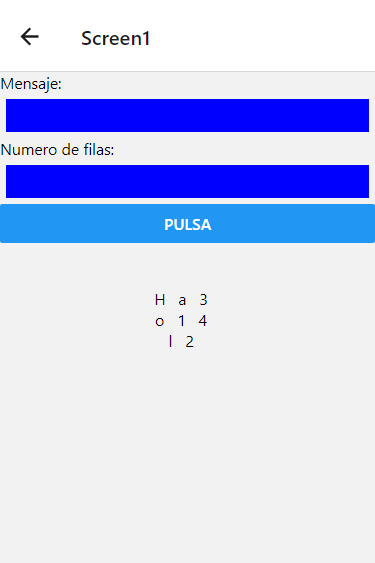

#Introducción

Bienvenido a mis proyectos en React-Native, para simplificar el repositorio solo subiré el codigo necesario para que la aplicación funcion en [Snack](https://snack.expo.dev/) 
una pagina donde simplemente copiando y pegando el codigo se puede ver el funcionamiento de las aplicaciones.

El codigo de cada proyecto se encuentra en la rama indicada para cada caso.

## Calculadora 

Se trata de una calculadora cientifica básica.

Rama : Calc

## Juego Sencillo

Estos dos juegos son un proyecto en parejas realizando utilizando la metodología SCRUM, es decir, se trata de un producto mínimo viable.

En la primera pantalla tenemos un crucigrama, donde al pulsar el titulo nos aparecen las definiciones de las palabras.

En la segunda pantalla tenemos un titulo, donde al pulsar, aparece una sopa de letras.

Como es un trabajo en parejas el codigo está en otro repositorio.

[Enlace al repositorio](https://github.com/hugoestelles/PMDM_AE2)

## Manejo de APIs

Se trata de un proyecto con varias navegaciones donde utilizo diversas APIS.

En la pantalla 'Home' encontramos dos botones, para ir a las diferentes pantallas.

En la 'Pantalla 1' podemos introducir un texto y el numero de filas y la aplicacion se encargara de modificar el texto para que aparezca de forma vertical dividio en las filas indicadas, es decir, si introducimos "hola" y 2 filas obtendremos:
h l
o a

En la 'Pantalla 2' encontramos una navegacion tab, con dos pantallas mas cada una con sus apis y sus funcionalidades
En la primera pantalla tab utilizo una api de rick y morty para cargar personajes e ir pasando de uno a otro de forma circular, es decir, si desde la posicion 1 pulsamos atrás nos mandará a la posicion 20. Los botones de siguientes y anteriores hacen lo mismo pero de 20 en 20.

En la segunda pantalla tab utilizamos una api de jugadores de baloncesto para buscar jugadores por nombre, nos 20 jugadores por pantalla con posibilidad de ir pasando páginas hasta llegar al fin de la lista, donde si pulsamos siguiente nos mandará al principio de la lista.

Rama : APIS

## Calculadora IMC

Se trata de una calculadora IMC a partir del peso y la altura

Rama : IMC

## FakeStagram

Imitacion del diseño de instagram.

Rama: IG
